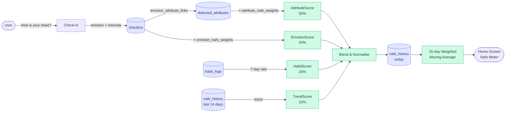
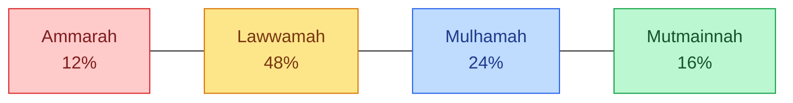

# Heart OS — Architecture Diagram

> The four-layer model, rendered as Mermaid diagrams. For an interactive HTML rendering, see [`../../docs/HEART_OS_ARCHITECTURE.html`](../../docs/HEART_OS_ARCHITECTURE.html).

---

## 1 · The four layers (overview)

```mermaid
flowchart TB
    subgraph L1["🟡 LAYER 1 — KNOWLEDGE (immutable, seed once)"]
        ATTR[attributes<br/>200 records]
        EMOT[emotions<br/>50 records]
    end

    subgraph L2["🟣 LAYER 2 — GRAPH (relationships & intelligence)"]
        EAL[emotion_attribute_links]
        AL[attribute_links<br/>Heart Graph]
        DOM[domains<br/>10 records]
        DAL[domain_attribute_links]
        DEL[domain_emotion_links]
    end

    subgraph L3["🟢 LAYER 3 — NAFS ENGINE (scoring spine)"]
        NS[nafs_states<br/>4 records]
        ANW[attribute_nafs_weights]
        ENW[emotion_nafs_weights]
    end

    subgraph L4["🔵 LAYER 4 — USER (activity & history)"]
        CHK[checkins]
        DA[detected_attributes]
        IH[interventions_history]
        NH[nafs_history]
        HAB[habits]
        HL[habit_logs]
    end

    EMOT --> EAL
    ATTR --> EAL
    ATTR --> AL
    ATTR --> DAL
    DOM --> DAL
    DOM --> DEL
    EMOT --> DEL
    ATTR --> ANW
    EMOT --> ENW
    NS -.weights.-> ANW
    NS -.weights.-> ENW
    EMOT --> CHK
    CHK --> DA
    CHK --> IH
    CHK --> NH
    HAB --> HL

    classDef know fill:#fef3c7,stroke:#f59e0b,color:#78350f
    classDef graph fill:#ede9fe,stroke:#8b5cf6,color:#4c1d95
    classDef nafs fill:#d1fae5,stroke:#10b981,color:#064e3b
    classDef user fill:#dbeafe,stroke:#3b82f6,color:#1e3a8a

    class ATTR,EMOT know
    class EAL,AL,DOM,DAL,DEL graph
    class NS,ANW,ENW nafs
    class CHK,DA,IH,NH,HAB,HL user
```

## 2 · Data flow (one check-in → Nafs meter)



## 3 · The Nafs Meter (visual)



## 4 · Layer responsibilities (summary)

| Layer | Purpose | Mutable at runtime? | Read by | Written by |
|---|---|---|---|---|
| Knowledge | Static Islamic content | ❌ | All | Seed script |
| Graph | Relationships | ❌ | Insight, Pathways | Seed script |
| Nafs Engine | Scoring spine | ❌ | All | Seed script |
| User | Activity & history | ✅ | All | App (check-in pipeline) |

The **only** layer that changes at runtime is the User layer. Everything else is shipped in the binary.

## 5 · See also

- [`../00_root/architecture.md`](../00_root/architecture.md) — the prose version.
- [`../00_root/erd.md`](../00_root/erd.md) — the table-level details.
- [`../../docs/HEART_OS_ARCHITECTURE.html`](../../docs/HEART_OS_ARCHITECTURE.html) — interactive HTML version.
