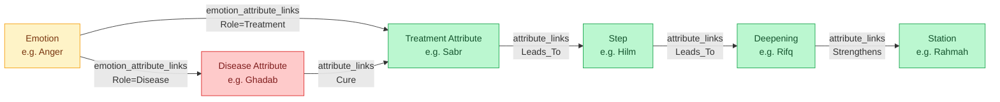
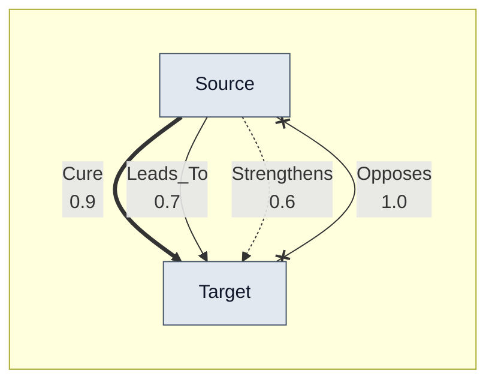

# Heart OS — Heart Graph Diagram

> The directed multigraph over the 200 attributes, visualised. This is the "brain" of Heart OS — see [`../00_root/heart_graph.md`](../00_root/heart_graph.md) for the prose.

---

## 1 · Conceptual overview

## 2 · The four edge types

| Edge | Weight | Example |
|---|---|---|
| `Cure` | 0.9 | Ghadab → Sabr |
| `Leads_To` | 0.7 | Sabr → Hilm |
| `Strengthens` | 0.6 | Hilm → Rifq |
| `Opposes` | 1.0 | Kibr ↔ Tawadu |

## 3 · The 8 master pathways (sub-graphs)

## 4 · Graph properties

| Property | Value |
|---|---|
| Nodes | 200 attributes |
| Edges | ~400 directed |
| Density | ~2% (sparse) |
| Avg out-degree | 2.0 |
| Hub attributes (degree ≥ 10) | Sabr, Shukr, Tawakkul, Tawadu, Ikhlas, Muraqabah |
| Cycle count in `Cure`+`Leads_To` | 0 (verified at seed) |

## 5 · See also

- [`../00_root/heart_graph.md`](../00_root/heart_graph.md) — the prose.
- [`../02_relationships/attribute_links.md`](../02_relationships/attribute_links.md) — the edge table.
- [`../05_pathways/`](../05_pathways/) — the 8 master pathways in detail.
