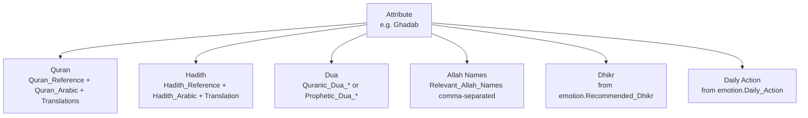
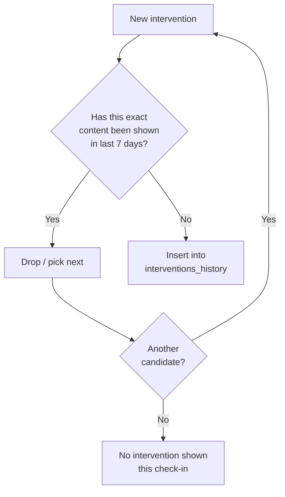
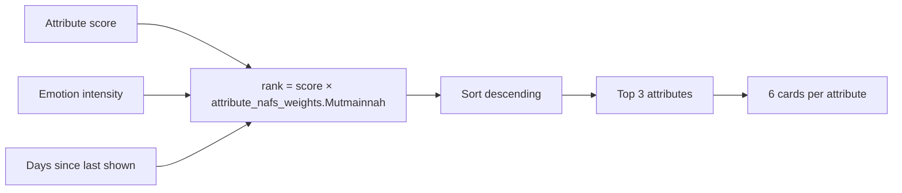

# Heart OS — Recommendation Engine Diagram

> How a check-in becomes a set of Quran · Hadith · Dua · Names · Dhikr · Action recommendations. Deterministic, graph-based, no AI.

---

## 1 · The recommendation pipeline

```mermaid
flowchart LR
    CK[(checkins<br/>today)] --> S1[Step 1: Resolve emotion]
    S1 --> EAL[emotion_attribute_links]
    EAL --> S2[Step 2: Top 3 detected attributes]
    S2 --> S3[Step 3: For each attribute<br/>pull 6 intervention types]
    S3 --> S4[Step 4: Filter<br/>no repeat in 7 days]
    S4 --> S5[Step 5: Rank by<br/>attribute_nafs_weights + intensity]
    S5 --> S6[6 cards on Intervention screen]
    S6 --> S7[User marks Done]
    S7 --> S8[(interventions_history<br/>Completed = 1)]

    classDef store fill:#e0e7ff,stroke:#6366f1
    classDef step fill:#d1fae5,stroke:#10b981
    class CK,S8 store
    class S1,S2,S3,S4,S5 step
```



## 2 · The 6 intervention types per attribute



## 3 · The 7-day no-repeat filter



## 4 · The ranking formula



The proposed v1 ranking (see `../08_algorithms/recommendation_algorithm.md`):

```
   rank = (attribute.Score × 0.6)
        + (emotion.Intensity / 10 × 0.3)
        + (days_since_shown / 7 × 0.1)
```

## 5 · The "why" behind every recommendation

Every card carries a **provenance trail**:

```
   Quran card:
     → attribute.Ghadab.Quran_Reference
     → "Surah Aal-i-Imraan 3:134"
     → "Recommended because you logged Anger, which surfaces Ghadab."

   Hadith card:
     → attribute.Ghadab.Hadith_Reference
     → "Sahih al-Bukhari 6116"
     → "The Prophet (ﷺ) said: 'The strong man is the one who controls his anger.'"

   Dua card:
     → emotion.Anger.Recommended_Dua
     → "Allahumma ihdini li ahsani al-akhlaq"
     → "A dua the Prophet (ﷺ) taught for guidance in character."

   Names card:
     → attribute.Ghadab.Relevant_Allah_Names
     → "Al-Halim (The Forbearing), Ar-Rahim (The Merciful)"
     → "Reflect on these names 11× after each Salah."

   Dhikr card:
     → emotion.Anger.Recommended_Dhikr
     → "SubhanAllahi wa bihamdihi"
     → "100× in the morning."

   Action card:
     → emotion.Anger.Daily_Action
     → "Remain silent and perform wudu."
     → "The Prophetic prescription for the onset of anger."
```

This is what makes the system **explainable**. The user can always see *why* a card was shown.

## 6 · Why graph-based, not LLM

| Aspect | Graph-based | LLM-based |
|---|---|---|
| Latency | < 50 ms | 1–5 s |
| Network | None | Required |
| Cost | Free | Per-token |
| Explainability | Full | Partial |
| Determinism | Yes | No |
| Privacy | Local | Cloud |
| Authoritative | Yes (Islamic sources) | Depends on training |

The v1 design uses **graph-based** exclusively. An LLM can be added in v2 as an *optional* reflective companion — see `../09_future/ai_layer.md`.

## 7 · See also

- [`../08_algorithms/recommendation_algorithm.md`](../08_algorithms/recommendation_algorithm.md) — the formal algorithm.
- [`../02_relationships/emotion_attribute_links.md`](../02_relationships/emotion_attribute_links.md) — the source of the attribute list.
- [`../02_relationships/attribute_links.md`](../02_relationships/attribute_links.md) — the growth path source.
- [`../01_core_tables/attributes.md`](../01_core_tables/attributes.md) — the intervention content.
- [`../01_core_tables/emotions.md`](../01_core_tables/emotions.md) — the Dhikr + Action.
