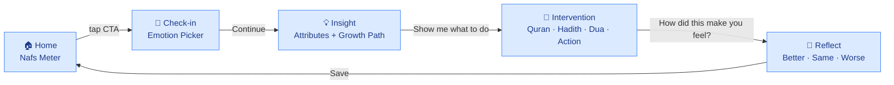
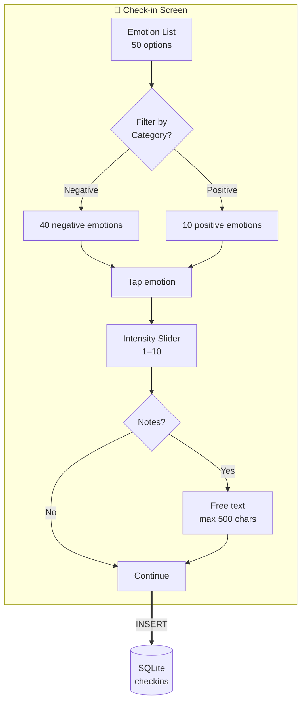
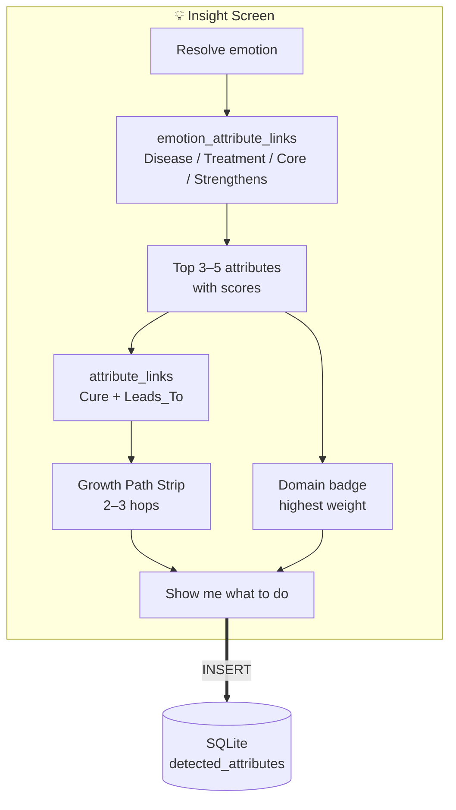
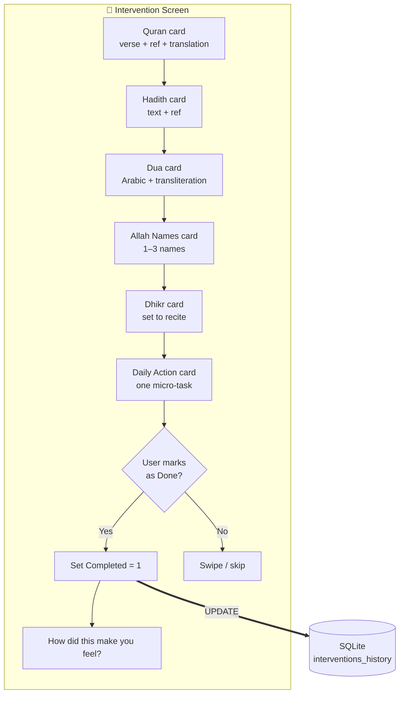
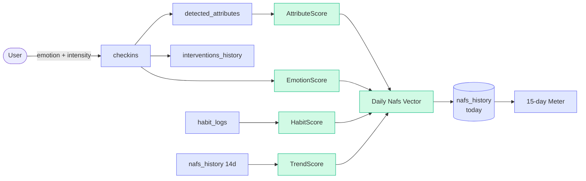
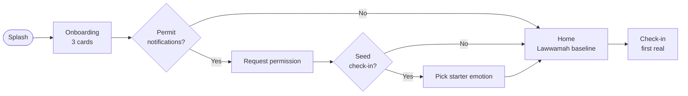

# Heart OS — User Flow Diagram

> The 5-screen core loop, rendered as Mermaid. For the prose walkthrough, see [`../00_root/user_flow.md`](../00_root/user_flow.md).

---

## 1 · The 5-screen loop

## 2 · Detailed Check-in screen

## 3 · Detailed Insight screen

## 4 · Detailed Intervention screen

## 5 · The data pipeline behind the loop

## 6 · First-run flow

## 7 · See also

- [`../00_root/user_flow.md`](../00_root/user_flow.md) — the prose walkthrough.
- [`../00_root/architecture.md`](../00_root/architecture.md) — the 4-layer model.
- [`../00_root/scoring_engine.md`](../00_root/scoring_engine.md) — the algorithm behind the meter.
