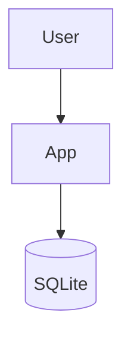

# Style Guide

> Conventions for writing and formatting the Heart OS documentation. Companion to `CONTRIBUTING.md`.

---

## 1 · Tone

The documentation is:

- **Technical** — accurate, specific, no hand-waving.
- **Warm** — we are documenting a spiritual system, not a CRM.
- **Direct** — short sentences, active voice, no filler.
- **Respectful** — Islamic terms are introduced with their Arabic, then used in transliteration.

Avoid:

- Marketing language ("revolutionary", "game-changing").
- Religious exclusivity or judgment.
- Casual abbreviations ("etc." is fine; "lol" is not).

## 2 · Voice

Use **second person** for user-facing docs (the user-flow doc, the intervention doc).

Use **third person** for system-facing docs (the ERD, the algorithms, the schema).

Use **first person plural** sparingly, only in the README of each section.

## 3 · Headings

| Level | Use | Example |
|---|---|---|
| `#` | File title | `# attributes` |
| `##` | Major section | `## Schema` |
| `###` | Sub-section | `### Column definitions` |
| `####` | Minor sub-section | `#### Edge cases` |

Never use more than 4 levels of heading.

## 4 · Lists

Use `-` for unordered, `1.` for ordered. Indent nested lists with 2 spaces.

```markdown
- Top item
  - Nested item
  - Another nested
- Second top
```

## 5 · Code blocks

Always specify the language:

````markdown
```sql
SELECT * FROM emotions;
```
````

For Mermaid, the language tag is optional but `mermaid` is fine.

## 6 · Tables

Use markdown tables. Right-align numeric columns:

```markdown
| ID | Name | Score |
|---:|---|---:|
| 1 | Foo | 0.95 |
| 2 | Bar | 0.42 |
```

Left-align text columns.

## 7 · Emphasis

- **Bold** for important terms and file/table names on first mention.
- *Italic* for emphasis on a single word.
- `code` for column names, function names, file paths, constants.
- > for callouts (e.g. a warning or a "see also" to another file).

## 8 · Em-dash vs en-dash vs hyphen

| Glyph | Use | Example |
|---|---|---|
| `—` (em-dash) | Apposition | "The user — not the app — owns the data." |
| `–` (en-dash) | Ranges | "1–10", "2020–2026" |
| `-` (hyphen) | Compound words | "many-to-many", "offline-first" |

## 9 · Islamic terms

- First mention: write both Arabic and transliteration, e.g. *"Sabr (صبر)"*.
- Subsequent mentions: use the transliteration only.
- Use the standard transliteration scheme (e.g. *dhikr* not *zikr*, *salat* not *salah* in formal text, but both are acceptable in informal).
- For Quran: use the standard English name (*Surah Al-Baqarah*) and the surah:ayah reference (*2:153*).
- For Hadith: cite the collection and the number (*Sahih al-Bukhari 91*).

See `GLOSSARY.md` for the canonical list.

## 10 · Numbers

- Spell out one through nine.
- Use digits for 10 and above.
- Use commas for thousands: 1,000; 10,000.
- Use scientific notation for very large or very small numbers.
- Percentages: use a space between the number and the % sign, per the SI convention: 50 % (in formal docs), 50% (in casual docs).

## 11 · Code style

- Dart code should follow the project's `analysis_options.yaml`.
- SQL keywords in UPPERCASE, identifiers in `PascalCase` for columns and `snake_case` for tables (to match the existing seed files).
- Python code uses snake_case and type hints.

## 12 · Linking

- Use **relative** links for files within `HeartOS/`.
- Use **descriptive** link text — never "click here" or "this".
- Quote marks around link text are not needed.

Good:
```markdown
See [the architecture doc](../00_root/architecture.md) for the four-layer model.
```

Bad:
```markdown
See [this](../00_root/architecture.md) for more.
```

## 13 · Mermaid conventions

Use the colour classes defined in `CONTRIBUTING.md` §4.

Always include a text description *after* the diagram for accessibility (screen readers don't read Mermaid).

Example:

````markdown


The user interacts with the app, which reads from and writes to the local SQLite database. No network calls are involved.
````

## 14 · What to avoid

| ❌ Don't | ✅ Do |
|---|---|
| "The user can click here to do X" | "Tap the X button to do X" |
| "Various factors" | List the factors |
| "It is important to note that…" | Just say it |
| "In conclusion, …" | Cut to the point |
| "Riya is the act of showing off" | "Riya is *riyāʾ* (showing off) — one of the 200 negative attributes in `01_core_tables/attributes.md`" |
| Long inline code | Use a code block |

## 15 · Versioning

The documentation is versioned alongside the app. The version appears in:

- `CHANGELOG.md` — full history.
- The top of every file (e.g. "*Last updated: 2026-06-12*").

When the app version changes, the docs version changes too.

## 16 · Accessibility

- Every diagram has a text description.
- Every link has descriptive text.
- Every table has a header row.
- Use sentence case for headings (capitalise the first word and proper nouns only).

## 17 · Reviewing someone else's doc

When reviewing a doc PR:

1. **Accuracy** — are the schemas correct? Are the algorithms sound?
2. **Completeness** — are all the required sections present?
3. **Consistency** — does it use the same terminology as the rest of the docs?
4. **Clarity** — could a new contributor understand it?
5. **Style** — does it follow this style guide?

If any of these are wrong, request changes. Be specific in your feedback.

---

*Heart OS v1 — Style is the visible surface of clarity.*
